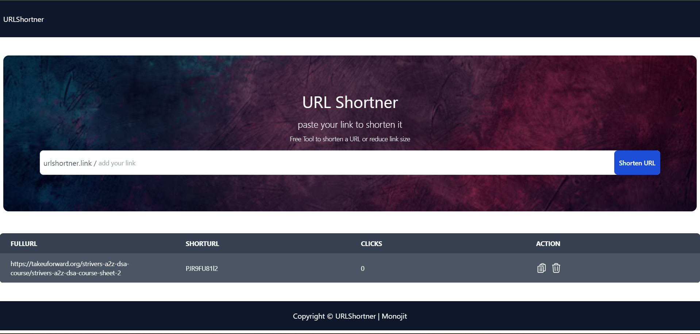
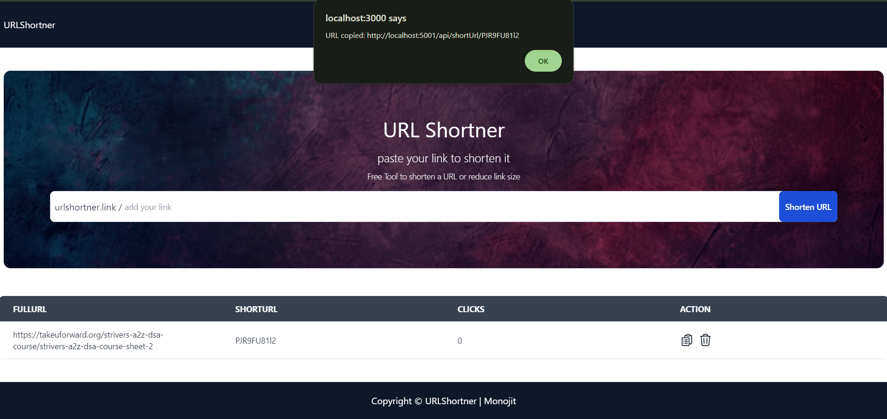
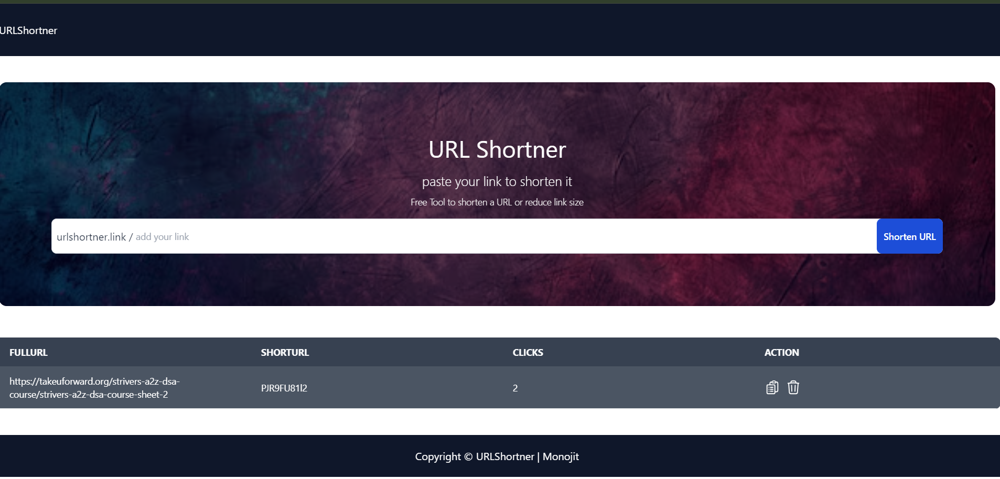

# Cached URL Shortner

Developed a Scalable URL Shortener API for persistent storage of URL mappings.

adding url to shorten it



copying shortend link



Syncing the click count after every one miniute using node-cron package




## Run Locally

Clone the project

```bash
 fit clone https://github.com/FlowerC9/Redis-Url-Shortner
```

Go to the project directory

```bash
  cd Redis-Url_Shortner
```

Go to server

```bash
  cd server
```
Install dependencies on server

```bash
  npm install
```
Start the server

```bash
  npm run dev
```

Go to client

```bash
  cd client
```

Install dependencies on client

```bash
    npm install
```
Start the client

```bash
  npm run dev
```

now its good to go.
